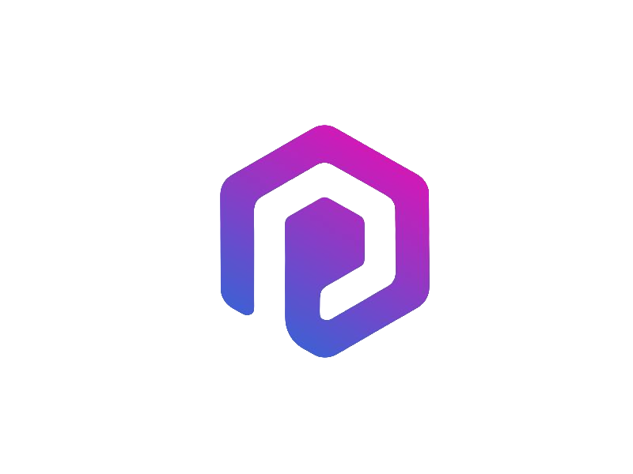

[![LinkedIn][linkedin-shield]][linkedin-url]

<!-- PROJECT LOGO -->
 

  

  <h3 align="center">PEER</h3>

  

    Welcome to our One of a Kind AI thats helps you have success with your Programming projects!
     
    <a href="https://docs.google.com/document/d/1TVHHxWStalxJ9Wl_jGEtV6yO9A4AKpri/edit?usp=sharing&ouid=106028197439135945538&rtpof=true&sd=true"><strong>Explore The Docs »</strong></a>
     
     
    <a href="">View Demo</a>
    ·
    <a href="">Report Bug</a>
    ·
    <a href="">Request Feature</a>
  

<!-- TABLE OF CONTENTS -->

  
Table of Contents

  <ol>
    <li>
      <a href="#about-the-project">About The Project</a>
      <ul>
        <li><a href="#built-with">Built With</a></li>
      </ul>
    </li>
    <li><a href="#license">License</a></li>
    <li><a href="#contact">Contact</a></li>
    <li><a href="#acknowledgments">Acknowledgments</a></li>
  </ol>

<!-- ABOUT THE PROJECT -->
## About The Project

A Discord Bot that generates written feedback for a product spec. All you have to do is give the link to the Notion page containing your product spec to our bot, and PEER will do the rest. Created as part of the AI Camp Team Tomorrow Incubator Program to be used initially by the AI Camp Internal Tech Team in the AI Camp Discord.

Members include Blake Martin, Reign O'Keefe, Vamsee Cheruvu, Dylan Lim, Ian Kergott, and Amogh Janganure.

### Built With

For the past 5 weeks, Team PEER has built a one of kind AI all with just Pure Python!!

 [![Next][Next.js]][Next-url]

<!-- LICENSE -->
## License

Distributed under the AI Camp License. 
©AI Camp

## Team

[Reign O'Keefe](https://github.com/ReignOkeefe) | 
[Blake Martin](https://github.com/bamartin1618) |
[Vamsee Cheruvu](https://github.com/VamseeC21)|
[Dylan Lim](https://github.com/WizardLord160)|
[Amogh Janganure]()|
[Ian Kengott](https://github.com/iankengott)

<!-- MARKDOWN LINKS & IMAGES -->
<!-- https://www.markdownguide.org/basic-syntax/#reference-style-links -->
[linkedin-shield]: https://img.shields.io/badge/-LinkedIn-black.svg?style=for-the-badge&logo=linkedin&colorB=555
[linkedin-url]: https://www.linkedin.com/company/ai-camp/
[product-screenshot]: images/screenshot.png
[Next.js]: https://th.bing.com/th/id/R.9f481549ceff580a494504b798a40dd3?rik=dcaw87c9fwzx%2fA&riu=http%3a%2f%2fwww.cs.sfu.ca%2fCourseCentral%2f166%2foshklars%2f_images%2fpython-logo.gif&ehk=yHfaOFUvECyPDFcgX1AhxAYUNIvKuUxweLH39Q9Zq48%3d&risl=&pid=ImgRaw&r=0&adlt=strict
[Next-url]: https://www.python.org/?adlt=strict&toWww=1&redig=09A470734269416FBB0E8396F4431CBC

